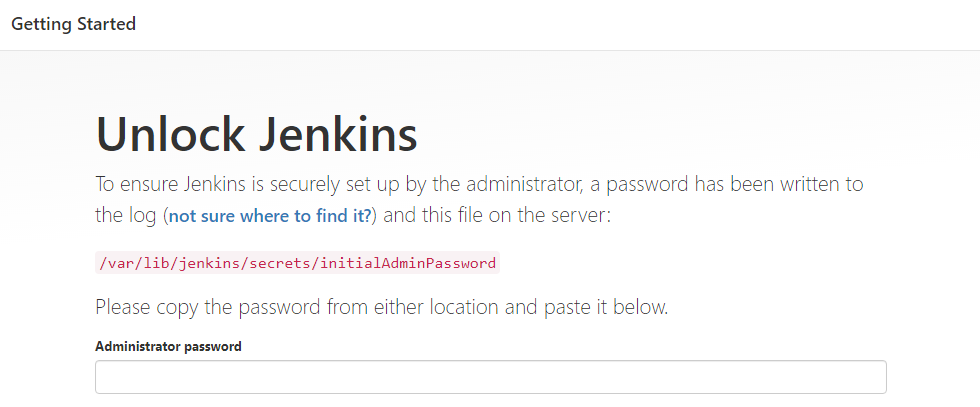
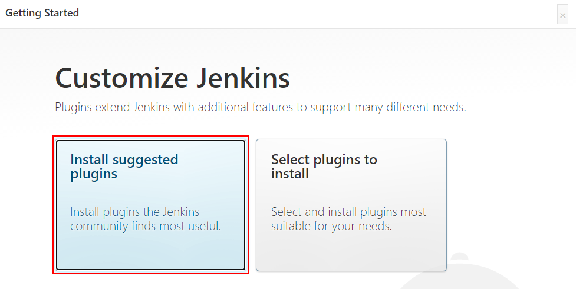

# Project 9 - Continuous Integration Pipeline For Tooling Website

**Step 1 - Install Jenkins Server**
---

- Spin up a new Ubuntu server for Jenkins and enable port 8080 for communication. Run `sudo apt update` & `sudo apt upgrade`.

- Run the command below:
```
sudo apt install default-jdk-headless
wget -q -O - https://pkg.jenkins.io/debian-stable/jenkins.io.key | sudo apt-key add -
sudo sh -c 'echo deb https://pkg.jenkins.io/debian-stable binary/ > \
/etc/apt/sources.list.d/jenkins.list'
sudo apt update -y
sudo apt-get install jenkins
```

- Run `sudo systemctl status jenkins` to confirm Jenkins is running.

- Log into Jenkins by putting in http://<Jenkins-Server-Public-IP-Address-or-Public-DNS-Name>:8080 to initiate the setup.

- Upon reaching Jenkins, you would be asked to put in the administrator password. This can be found by running `sudo cat /var/lib/jenkins/secrets/initialAdminPassword`. Copy and paste it in the box.


- Next, install suggested plugins to install the basic plugins necessary for Jenkins.


- Once plugins installation is done, create an admin user and you will get your Jenkins server address.

**Step 2 - Configure Jenkins To Retrieve Source Codes From GitHub Using Webhooks**
---

- 