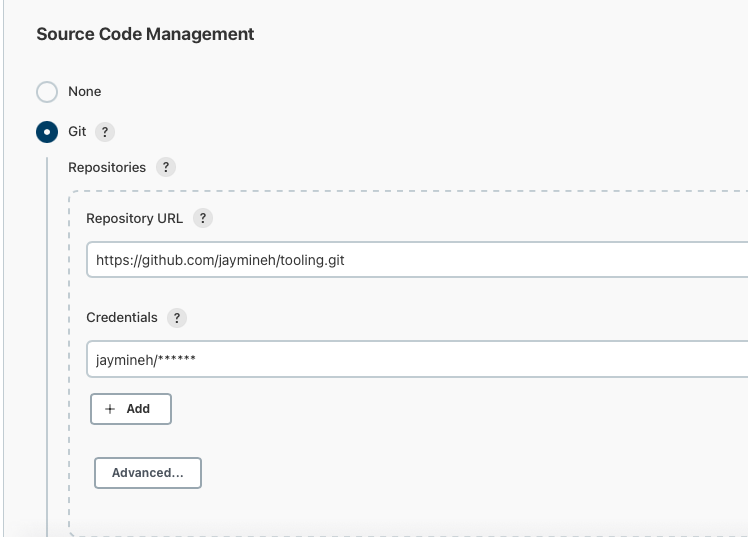
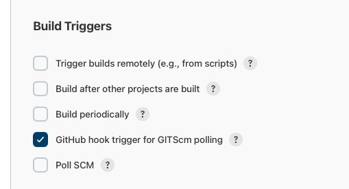
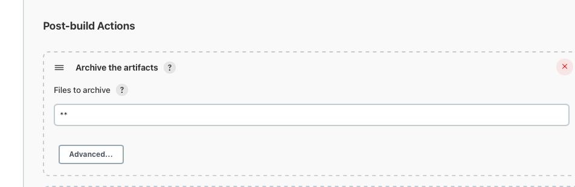

# Project 9 - Continuous Integration Pipeline For Tooling Website

**Step 1 - Install Jenkins Server**
---

- Spin up a new Ubuntu server for Jenkins and enable port 8080 for communication. Run `sudo apt update` & `sudo apt upgrade`.

- Run the command below:
```
sudo apt install default-jdk-headless
wget -q -O - https://pkg.jenkins.io/debian-stable/jenkins.io.key | sudo apt-key add -
sudo sh -c 'echo deb https://pkg.jenkins.io/debian-stable binary/ > \
/etc/apt/sources.list.d/jenkins.list'
sudo apt update -y
sudo apt-get install jenkins
```

- Run `sudo systemctl status jenkins` to confirm Jenkins is running.

- Log into Jenkins by putting in http://<Jenkins-Server-Public-IP-Address-or-Public-DNS-Name>:8080 to initiate the setup.

- Upon reaching Jenkins, you would be asked to put in the administrator password. This can be found by running `sudo cat /var/lib/jenkins/secrets/initialAdminPassword`. Copy and paste it in the box.


- Next, install suggested plugins to install the basic plugins necessary for Jenkins.


- Once plugins installation is done, create an admin user and you will get your Jenkins server address.

**Step 2 - Configure Jenkins To Retrieve Source Codes From GitHub Using Webhooks**
---

- Go to the tooling repo on GitHub (or repo in question), then go to settingsand click on webhook. The payload IP is `<http://Jenkins-Server-Public-Server-IP:8080/github-webhook/>`. The content type should be set to `application/json`.

- Go to the Jenkins home page ad click on new projects. Give the projet a name and select freestyle project.

- Copy the URL of the repo as that will be used to link Jenkins to the repo and work with it. After copying th URL, in the config setup of the Jenkins project, head over to source code management and  choose Git.


- Select credentials and input your GitHub credentials so Jenkins can have access to read activitie from the cloud repo.

- Save configuration and click on build now, which should build successfully with a green tick. This is a test to see if the connection is set up correctly.

- Click configure on the job/project and add the following configs:

    - GitScm Polling
    

    - Configure Post build actions to "archive the artifacts" and set it to ** for all files.
    

- Make a change to the README file in your GitHub repo and a new build should run on Jenkins. The artifacts are stored on Jenkins locally in this folder `/var/lib/jenkins/jobs/<nameofrepo>/builds/<build_number>/archive/`

**Step 3 – Configure Jenkins To Copy Files To NFS Server Via SSH**
---

- 
